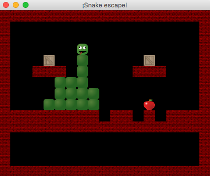

# Limerick

Limerick (or _snake scape_) is a solved programming exercise for my OOP Students at Politècnica de Catalunya,
based on the MSX game: [Griel's Holy Cup](http://www.msxgamesworld.com/gamecard.php?id=3666) from Momonoki House.

The code is in Spanish language (sorry for only-English speakers!)

## Cambios entrega 2

* Carga de niveles de archivo
    - Eliminada la clase `DatosNiveles`
    - Añadidas clases `CargadorNiveles` y `ArchivoMalFormateadoException`
    - `ControlJuego.cargaNiveles()` usa `CargadorNiveles`, y además ahora
      puede lanzar Excepciones, que deben ser cazadas en ControlJuego.partida()