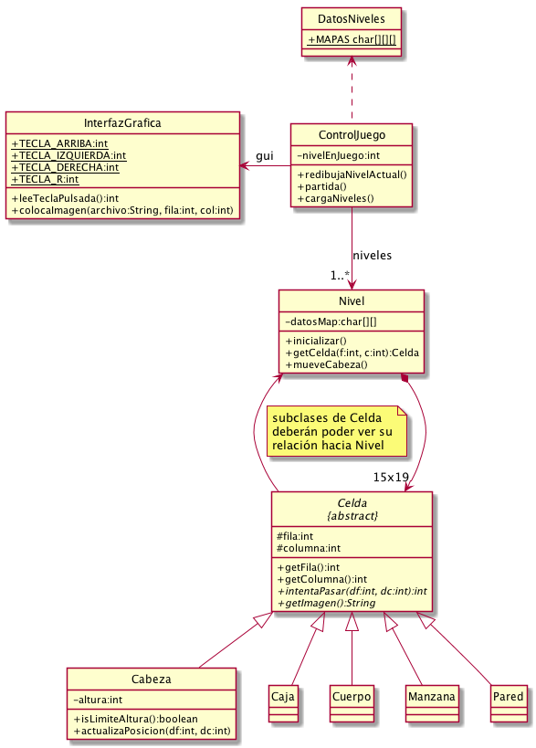
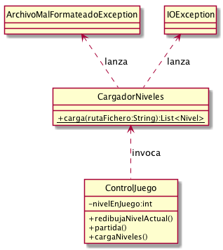

# Enunciado 2

## Parte 1: refactorización

Uso de herencia y polimorfismo. Se describen cambios a nivel de API pública o
privada, pero también hay que hacer cambios en el interior de los métodos
existentes, para adaptarse a la nueva API:

* `Celda` pasa a ser clase abstracta
    - Atributos `fila`, `columna` y `nivel` pasan a ser protected.
    - Atributo `tipo` desaparece.
    - Métodos `getFila` y `getColumna` se mueven de `Cabeza` hacia aquí.
    - Métodos `getImagen` y `intentaPasar` son ahora abstractos.
* La lógica de los objetos se implementa ahora en las subclases de `Celda`:
  `Caja`, `Manzana`, `Cuerpo`, `Pared`, que implementarán los métodos abstractos
  de su superclase.
* `Cabeza` pasa a ser también subclase de `Celda`.
    - Atributos `fila`, `columna` y `nivel` desaparecen, ya que están definidos
    en la superclase `Celda`.
* Cambios en `Nivel`
    - Añadidos métodos `setCelda` y `hayCelda`
* Cambios en carga de niveles
    - Añadida interfaz `CargadorNiveles` y clase `ArchivoMalFormateadoException`.
    - Añadida clase  `CargadorMemoria`, a cuyo método `carga()` se ma movido la
      lógica que antes había en `ControlJuego.carga()`

UML reflejando los cambios:

## Parte 2: E/S disco

- Añadida clase `CargadorDisco`.
- Cambiada instanciación de `ControlJuego` en método `main`.

## Parte 4: ampliación juego

Añadir nuevos elementos de juego, dejándolos a elección del usuario.
Algunas sugerencias:

- Semilla a la que se puede echar arena y agua, y crece un árbol con una
  manzana.
- Puerta con candado: que para pasar por ahí, la  serpiente necesite haber
  cogido primero una llave.
- Bomba: elemento que al tirarlo, explota y rompe todo lo que hay a su
  alrededor.
