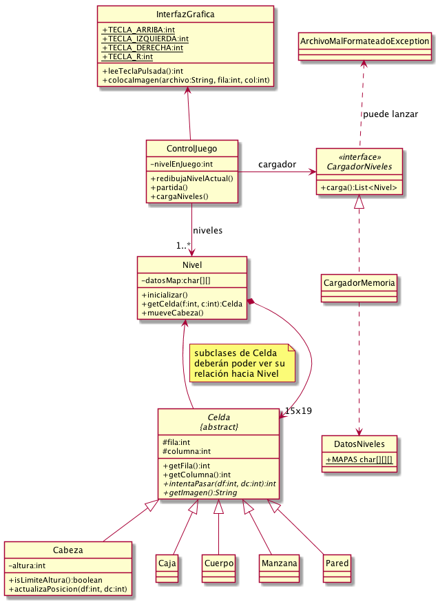
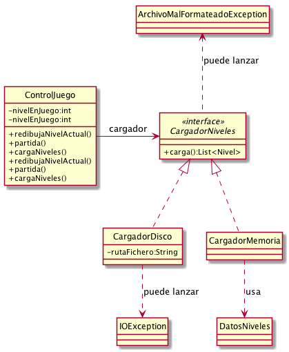

# Enunciado 2

## Parte 1: refactorización

Uso de herencia y polimorfismo. Se describen cambios a nivel de API pública o
privada, pero también hay que hacer cambios en el interior de los métodos
existentes, para adaptarse a la nueva API:

* `Celda` pasa a ser clase abstracta
    - Atributos `fila`, `columna` y `nivel` pasan a ser protected.
    - Atributo `tipo` desaparece.
    - Métodos `getFila` y `getColumna` se mueven de `Cabeza` hacia aquí.
    - Métodos `getImagen` y `intentaPasar` son ahora abstractos.
* La lógica de los objetos se implementa ahora en las subclases de `Celda`:
  `Caja`, `Manzana`, `Cuerpo`, `Pared`, que implementarán los métodos abstractos
  de su superclase.
* `Cabeza` pasa a ser también subclase de `Celda`.
    - Atributos `fila`, `columna` y `nivel` desaparecen, ya que están definidos
    en la superclase `Celda`.
* Cambios en `Nivel`
    - Añadidos métodos `setCelda` y `hayCelda`

UML reflejando los cambios:

## Parte 2: E/S disco

